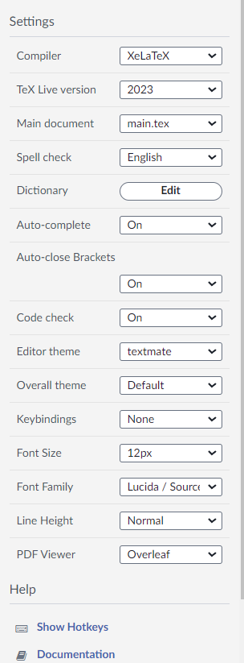

# 复旦信院24盲审格式 英文论文模板

[基于Xiangdong Zeng的fduthesis修改](https://github.com/stone-zeng/fduthesis)

本fduthesis调整版目前只适用于英文版；中文版后续会补充；

实际上本模板不仅适用于信院，我们基于很多要求进行了调整，需要英文写作的复旦学子，可尝试使用；

1. 本模板基于Xiangdong Zeng的fduthesis;
2. 结合学院盲审格式的要求+两个更严格的组的要求，进行调整
3. 对原fduthesis的修改包括但不限于，添加调整页眉，去掉目录页码，调整chapter名居中等。

我们基于学院及老师的要求,逐点修改，并非擅长系统编写latex，格式代码看起来不太整洁，见谅。

## 使用

可先试看模板pdf

1. 下载本项目

2. 上传至overleaf，overleaf设置如下：

## 贡献者

由以下人员基于fduthesis调整出此版本：
   * wenzhong he
   * haizhou zhang
